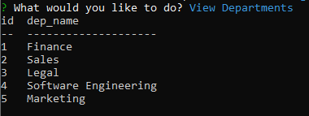
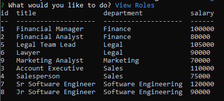
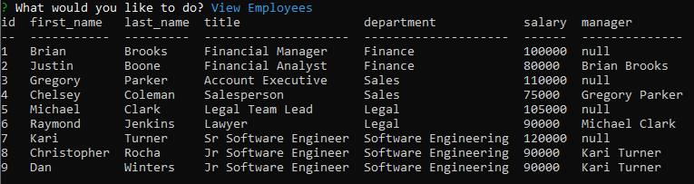

# Workplace Management Application

[](https://opensource.org/licenses/MIT)

## **Description**
The purpose of this project was to create a command-line application to allow for company employees to easily interact with a database layout of their firm structure. The database that holds the information needed has three tables; a departments table, a roles table, and an employees table.

## **Technologies**

* 
* 
* 

## **Installation**
First, you'll want to clone down this repository onto your local machine. You can do this by copying the code within the green code button towards the upper-righthand side of the screen and typing out `git clone *insert your copied code here*` within your command terminal.

Next, you'll want to type the following in the command line. This installs the dependencies that will be used. 
```
npm install
```

You'll want to have downloaded MySQL. Type the following into the command line: 
```
mysql -u root -p
```

Next, type the following when prompted for a password:
```
password
```

Next, you'll want to copy everything within the `schema.sql` file and paste it within the MySQL shell. Hit the `enter` key when done. (*note* = make sure you don't already have a database called "workplace_db" within your MySQL shell or else it will get deleted. Similarly, you can ommit line 1 from within `schema.sql` and simply change the name of the database on lines 2 and 4 to whatever you'd like.)

Do the same thing with the `seeds.sql` file and hit the `enter` key.

Next, type in the following to exit the MySQL shell:
```
exit
```

Lastly, you'll want to run Node to start the application. You can do this by typing the following within the command line at the root of the directory.
```
node server
```

## **Usage**
The following is a link to a video walkthrough of the application: 
[](https://drive.google.com/file/d/1cicr4u_ixHiiQqwalEx99Z3_7PiquRaq/view "Video Walkthrough")

## **Application**

Here is how the Departments table looks like:



Here is how the Roles table looks like:



Here is how the Employees table looks like:



## **License**
The following application is covered under the MIT License.